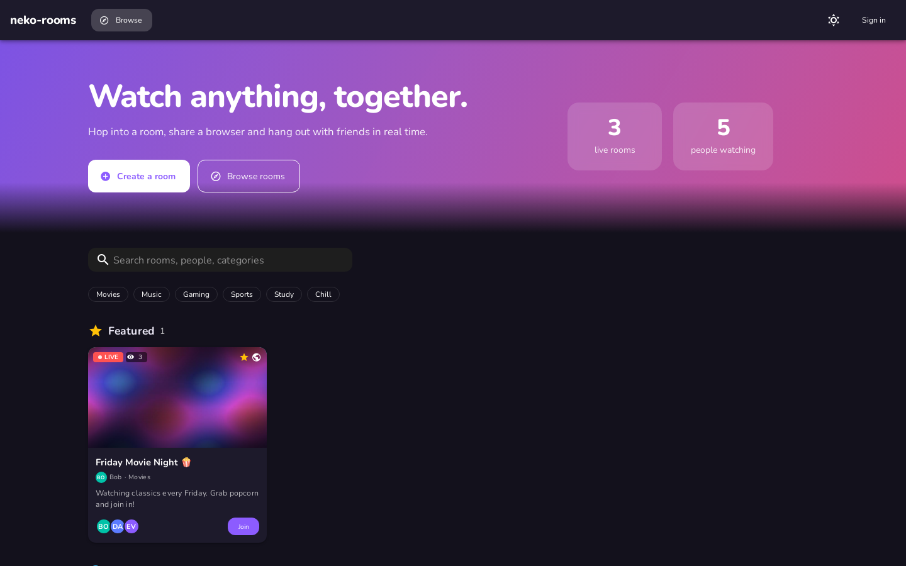
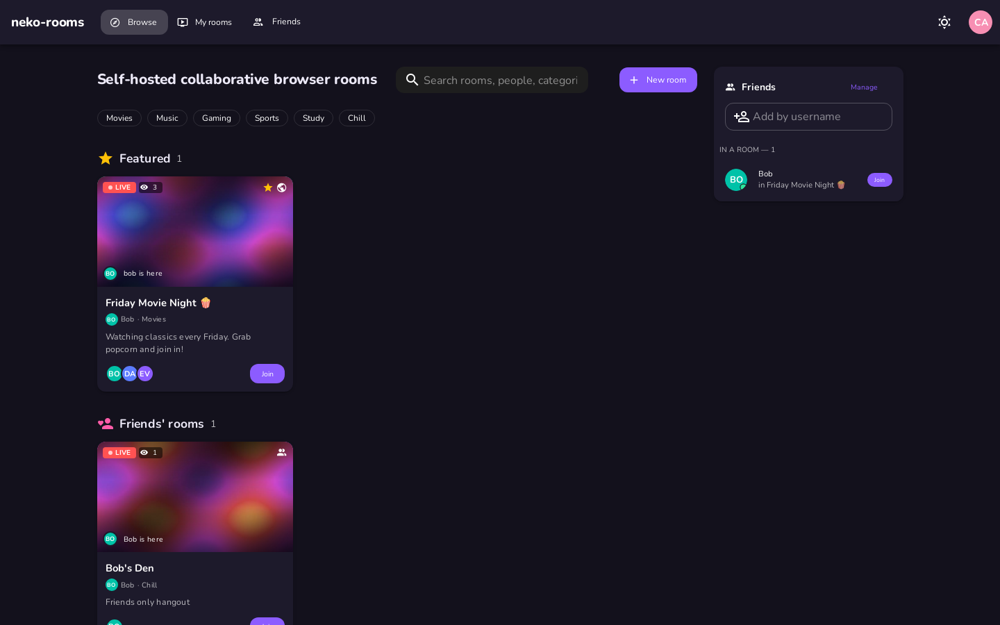
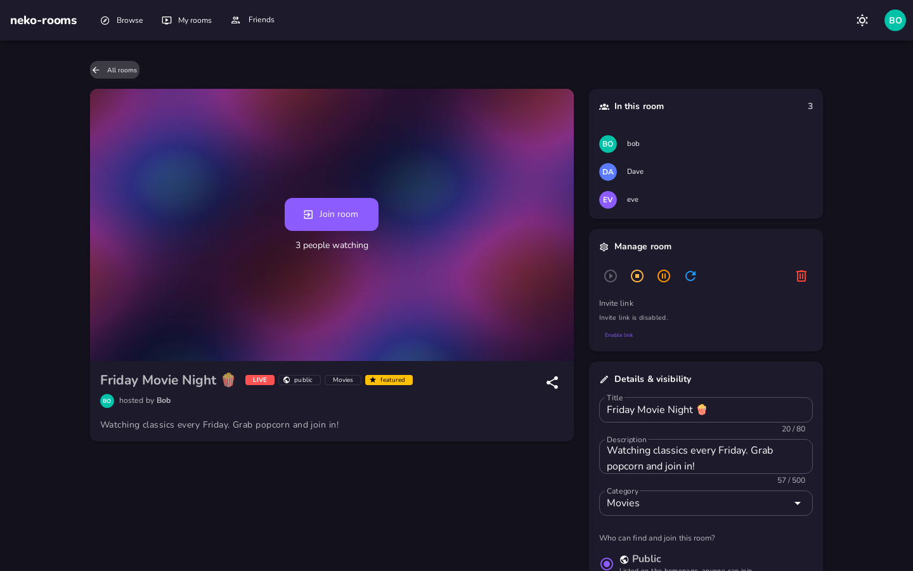
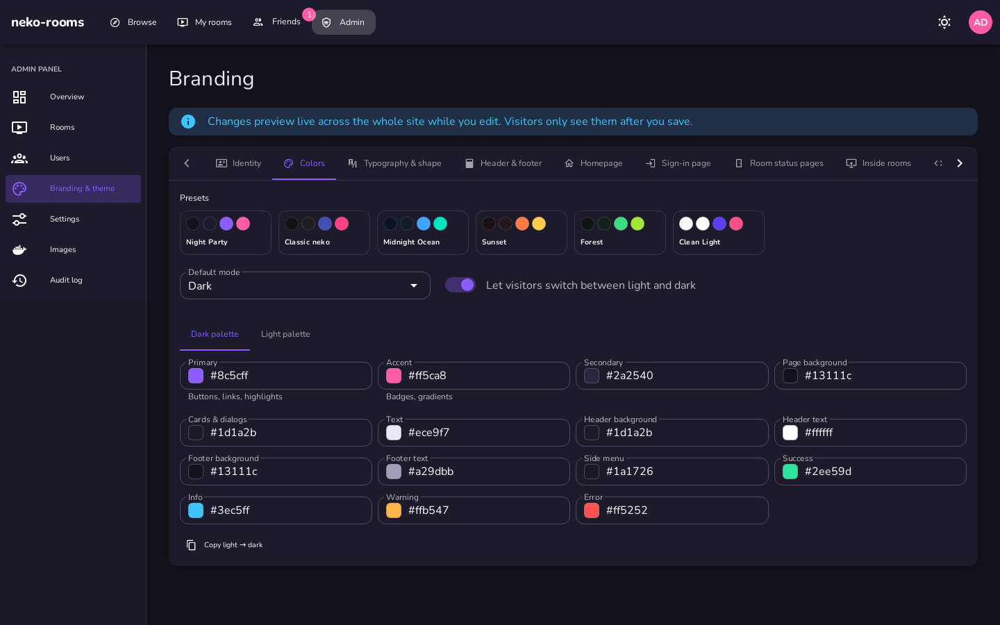
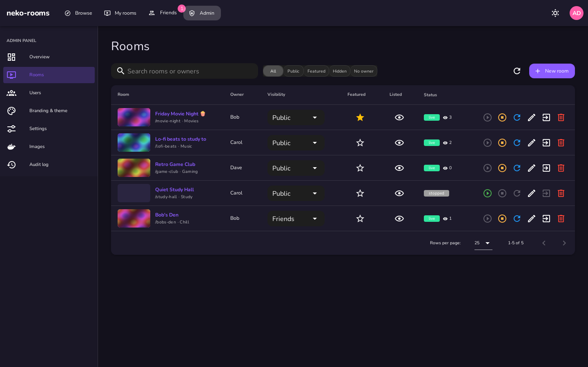
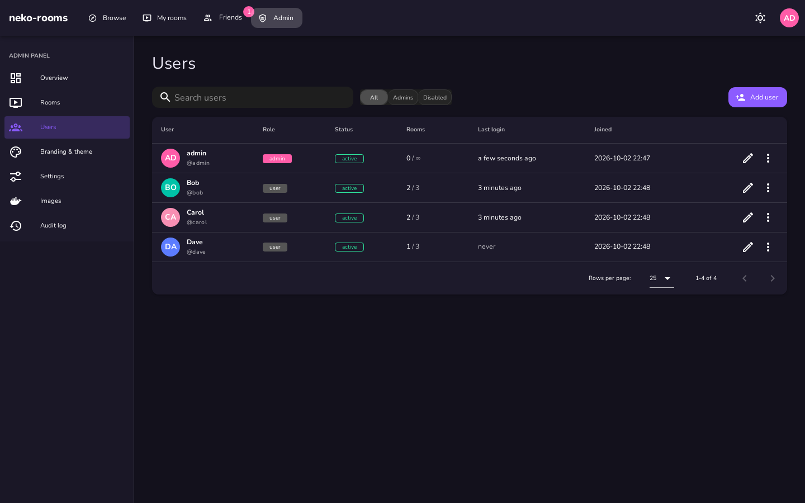

# Homepage, accounts & admin panel

This fork turns neko-rooms into a small community site, inspired by the old rabb.it:

- **Public homepage** at the root of your domain with a live room directory: thumbnails, viewer counts, who is inside, search and categories.
- **User accounts** with two roles, `admin` and `user`, stored in a SQLite database.
- **Friends**: send and accept requests, see which room your friends are in and join them.
- **Room ownership & visibility**: every room has an owner and is either `public` (listed on the homepage), `friends` (only the owner's friends) or `private` (invite link only).
- **Admin panel** to moderate rooms (feature, hide, transfer, start/stop/delete), manage users, set permissions and fully customize branding and theme, all without rebuilding anything.

<p align="center">
  
  
  
  
  
  
</p>

## Quick start

```yaml
services:
  neko-rooms:
    image: "ghcr.io/xo907/neko-rooms:latest"
    environment:
      # ... the usual NEKO_ROOMS_* settings ...
      - "NEKO_ROOMS_PATH_PREFIX=/room/"      # rooms live under /room/<name>, the homepage at /
      - "NEKO_ROOMS_ADMIN_USERNAME=admin"    # first admin account (first start only)
      - "NEKO_ROOMS_ADMIN_PASSWORD=change-me"
    volumes:
      - "/var/run/docker.sock:/var/run/docker.sock"
      - "./data:/data"                       # database: users, branding, settings
```

On first start, when the database has no users:

- if `NEKO_ROOMS_ADMIN_PASSWORD` is set, an admin account is created with it;
- otherwise a **one-time setup token** is printed in the logs (`docker logs neko-rooms | grep setup_token`). Open the site, and it will ask for the token and let you create the first admin.

The admin password variable is only used to create the first account. Change the password later in *Account* and remove the variable.

## Configuration

| Variable | Default | Description |
| --- | --- | --- |
| `NEKO_ROOMS_DATA_DIR` | `./data` (`/data` in Docker) | Directory of the SQLite database. **Mount it as a volume.** |
| `NEKO_ROOMS_ADMIN_USERNAME` | `admin` | Username of the initial admin. |
| `NEKO_ROOMS_ADMIN_PASSWORD` | – | Password of the initial admin. Empty = setup token. |
| `NEKO_ROOMS_ADMIN_PATH_PREFIX` | `/` | Where the site and the API are served. With a prefix like `/admin`, visitors of `/` are redirected there. |
| `NEKO_ROOMS_ADMIN_PROXY_AUTH` | – | Optional external auth URL in front of everything (unchanged from upstream). |
| `NEKO_ROOMS_PROXY` | `false` | Trust `X-Forwarded-*` headers. Enable behind a reverse proxy so client IPs and secure cookies work. |

Everything else (registration, permissions, branding…) is configured in the admin panel and stored in the database.

> **Upgrading from upstream:** HTTP basic auth (`admin.username`/`admin.password`) is replaced by real accounts. If you put basic auth in front of neko-rooms in your reverse proxy, remove it, otherwise visitors can not reach the public homepage.

## Roles & permissions

**Admins** can do everything: see and manage all rooms, manage users, change settings and branding, pull images, export docker-compose.

**Users** can manage only their own rooms. What they may do is set in *Admin → Settings*:

- create rooms, with a default room limit (overridable per user)
- make rooms public
- pull images, use host path mounts, attach devices/GPUs (off by default; these give access to the host)
- which neko images they can use, and a max connections cap

Other settings: open registration (optionally with admin approval), require sign-in to join any room, let guests browse the homepage, friends, thumbnails, member names, password length, session lifetime, audit log size.

Rooms created before this feature have no owner. They are visible to admins only until an admin assigns an owner and visibility in *Admin → Rooms*.

## Joining rooms

The homepage asks the server for a join link. It contains the room's neko password, so people never have to type it: users join as viewers and the owner and admins join as neko admins. Signed-in users join with their display name, and guests are asked for a nickname.

Private rooms get an invite link (`/#/r/<room>?invite=<code>`) that owners can copy, regenerate or disable on the room page.

## Branding & theme

*Admin → Branding & theme* changes the site live while you edit. Nothing is visible to others until you press **Save & publish**.

- **Identity**: site name, tab title, tagline, description, logo (+ light mode logo), favicon, mobile theme color
- **Colors**: presets, default mode (dark/light/system), visitor toggle, full dark and light palettes (primary, accent, backgrounds, cards, text, header, footer, side menu, status colors)
- **Typography & shape**: font family, Google Fonts URL or uploaded font file, heading font, base size, corner radius, button case, compact header
- **Header & footer**: visibility, logo size, links with icons, announcement banner, footer text and links, "powered by" credit
- **Homepage**: hero banner (text, image, gradient, when to show it), section names, empty state, card style, search, categories, friends sidebar
- **Sign-in page**: title, message, background color/image, form position, card transparency
- **Room status pages**: the pages shown for missing/stopped/paused/starting rooms, with their colors, logo and texts
- **Inside rooms**: optional injection of title, favicon, CSS, HTML and JS into the neko client page of each room (rooms proxied through neko-rooms)
- **Advanced**: custom CSS, `<head>` HTML (analytics…), JavaScript, export/import as JSON, reset to defaults, uploaded files

Uploaded files (images and fonts, up to 5 MB each) are stored in the database. SVGs are served with a restrictive Content Security Policy.

Custom CSS can use the theme variables `--nr-primary`, `--nr-accent`, `--nr-bg`, `--nr-surface`, `--nr-text`, `--nr-appbar`, `--nr-footer`, `--nr-radius`, `--nr-font`, `--nr-heading-font`.

## Locked out?

Use the built-in command inside the container:

```bash
docker exec neko-rooms /app/bin/neko_rooms users list
docker exec neko-rooms /app/bin/neko_rooms users reset-password admin 'new-password'
docker exec neko-rooms /app/bin/neko_rooms users create alice 'password' admin
docker exec neko-rooms /app/bin/neko_rooms users set-role alice admin
```

## API

The API stays under `/api`. Scripts can authenticate with HTTP basic auth using any account. Browser sessions use a secure, HTTP-only cookie, and state-changing requests from the browser must send `X-Requested-With`.

| Endpoint | Access |
| --- | --- |
| `GET /api/auth/status`, `POST /api/auth/{login,logout,register,setup}` | public |
| `GET /api/branding`, `GET /api/branding/assets/{name}` | public |
| `GET /api/public/rooms[/{name}]`, `POST /api/public/rooms/{name}/join`, `GET …/thumbnail.jpg` | public, filtered by visibility |
| `PUT /api/account`, `POST /api/account/password`, `GET/DELETE /api/account/sessions` | signed in |
| `GET/POST /api/friends`, `POST /api/friends/{id}/accept`, `DELETE /api/friends/{id}`, `GET /api/users/search` | signed in |
| `/api/rooms…`, `/api/config/rooms`, `/api/events` (upstream room API) | signed in; users only see/manage their own rooms |
| `GET/PUT /api/rooms/{id}/meta`, `POST /api/rooms/{id}/invite` | room owner or admin |
| `/api/pull…` | admin, or users if allowed |
| `/api/admin/…` (users, rooms, policy, branding, assets, audit, overview), `/api/docker-compose.yaml` | admin |

Room creation accepts an optional `meta` object next to the usual settings: `{"title", "description", "category", "visibility"}`.
